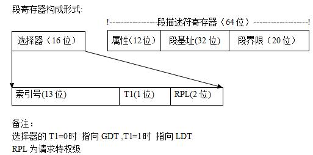
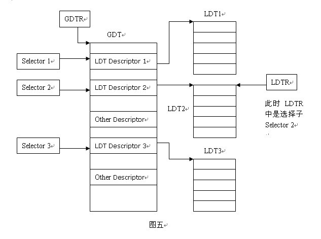
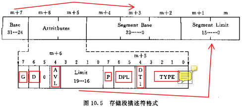
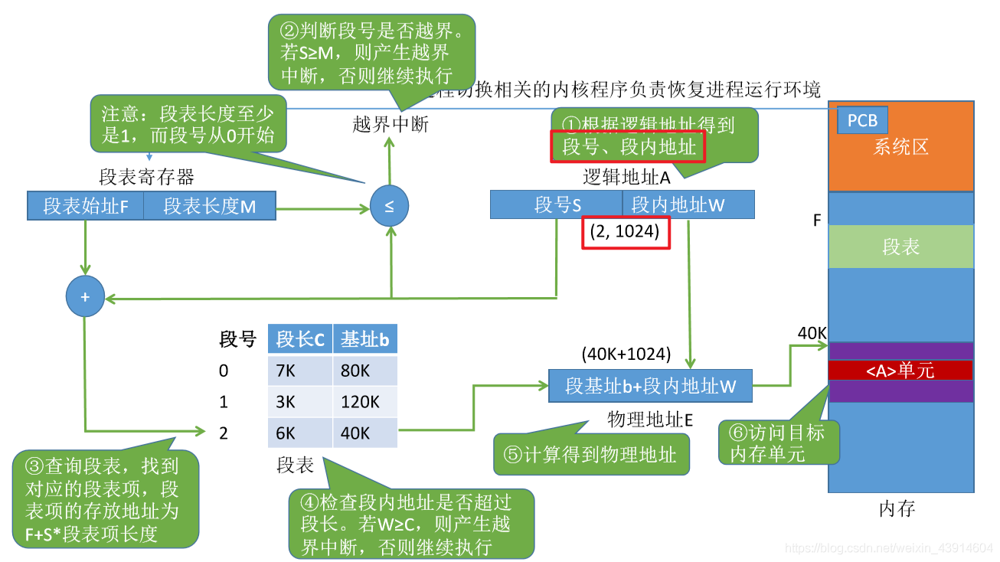
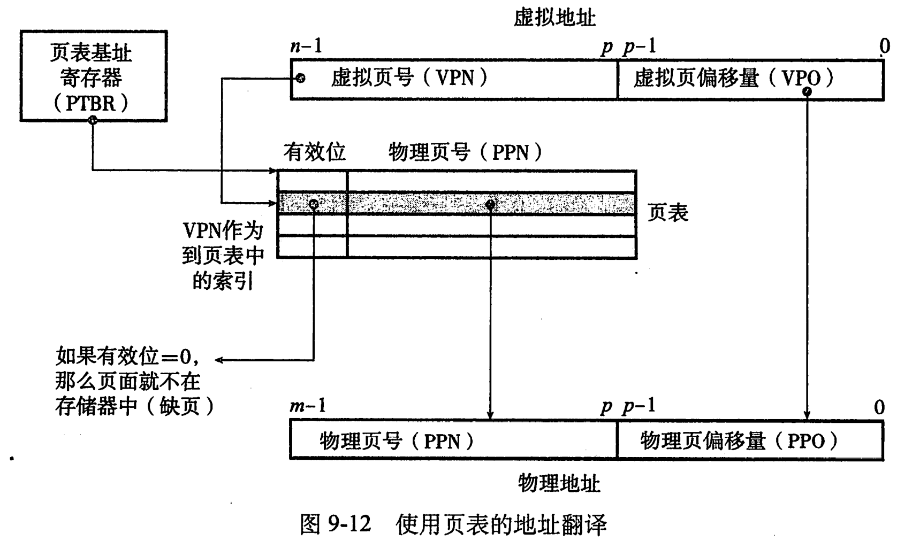

CPU就是一个资源，无论是硬件的也好，虚拟的也罢，关键在于如何分配

只要是资源，就可以被虚拟化表示，由硬件完成的工作也可以用软件模拟

软件的一切对于开发者来说都是透明的，因而对于学习者来说更为友好

# GDT与LDT

[GDT与LDT_billpig的博客-CSDN博客_gdt ldt](https://blog.csdn.net/billpig/article/details/5833980?spm=1001.2101.3001.6661.1&utm_medium=distribute.pc_relevant_t0.none-task-blog-2%7Edefault%7ECTRLIST%7ERate-1-5833980-blog-103324343.pc_relevant_multi_platform_whitelistv3&depth_1-utm_source=distribute.pc_relevant_t0.none-task-blog-2%7Edefault%7ECTRLIST%7ERate-1-5833980-blog-103324343.pc_relevant_multi_platform_whitelistv3&utm_relevant_index=1)

保护模式下的段寄存器 由 16位的选择器 与 64位的段描述符寄存器 构成
段描述符寄存器： 存储段描述符
选择器：存储段描述符的索引

# 分段与分页

[深入解析分段与分页_happysnaker的博客-CSDN博客_分段和分页](https://blog.csdn.net/m0_51380306/article/details/120275714)

