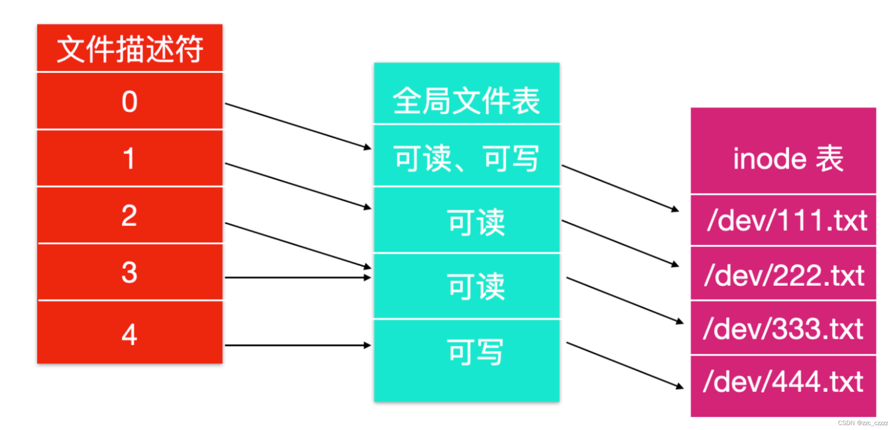

[谈谈linux内核学习：虚拟文件系统（VFS） - 知乎 (zhihu.com)](https://zhuanlan.zhihu.com/p/482045070)

[(104条消息) 浅谈linux中的根文件系统（rootfs的原理和介绍）_daijingxin的博客-CSDN博客_rootfs](https://blog.csdn.net/daijingxin/article/details/118514029)

[(104条消息) tmpfs详解_yeluomen的博客-CSDN博客_tmpfs](https://blog.csdn.net/sinat_24354307/article/details/122957782)

[(104条消息) Linux 文件系统_zzc_czzzz的博客-CSDN博客_linux文件系统](https://blog.csdn.net/qq_38276357/article/details/125173598)

默认情况下，前三个文件描述符为  **STDIN** (标准输入)、 **STDOUT** (标准输出)、 **STDERR** (标准错误)。

[(104条消息) Linux命令之stat命令_恒悦sunsite的博客-CSDN博客_linux stat](https://blog.csdn.net/carefree2005/article/details/122454333)

[FAT 与 Ext - 知乎 (zhihu.com)](https://zhuanlan.zhihu.com/p/557536447)

[#2021年底大盘点#FAT、NTFS 和 Ext3的区别_51CTO博客_FAT和NTFS](https://blog.51cto.com/u_10630401/4848629)

[(104条消息) FAT 组织形式 与 I-NODE 组织形式（Ext）_芒骁的博客-CSDN博客_ext 组织详解](https://blog.csdn.net/qq_44587855/article/details/106268470)

[(104条消息) 打开文件表、文件描述符、打开的文件句柄以及i-node之间的关系_风摇烨的博客-CSDN博客_打开文件表](https://blog.csdn.net/u010386121/article/details/106503680?spm=1001.2101.3001.6661.1&utm_medium=distribute.pc_relevant_t0.none-task-blog-2%7Edefault%7ECTRLIST%7ERate-1-106503680-blog-106268470.pc_relevant_3mothn_strategy_recovery&depth_1-utm_source=distribute.pc_relevant_t0.none-task-blog-2%7Edefault%7ECTRLIST%7ERate-1-106503680-blog-106268470.pc_relevant_3mothn_strategy_recovery&utm_relevant_index=1)
