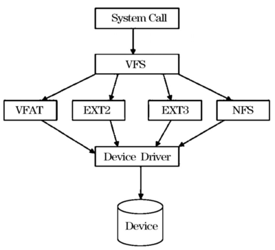

[谈谈linux内核学习：虚拟文件系统（VFS） - 知乎 (zhihu.com)](https://zhuanlan.zhihu.com/p/482045070)

[(104条消息) 浅谈linux中的根文件系统（rootfs的原理和介绍）_daijingxin的博客-CSDN博客_rootfs](https://blog.csdn.net/daijingxin/article/details/118514029)

[(104条消息) tmpfs详解_yeluomen的博客-CSDN博客_tmpfs](https://blog.csdn.net/sinat_24354307/article/details/122957782)
