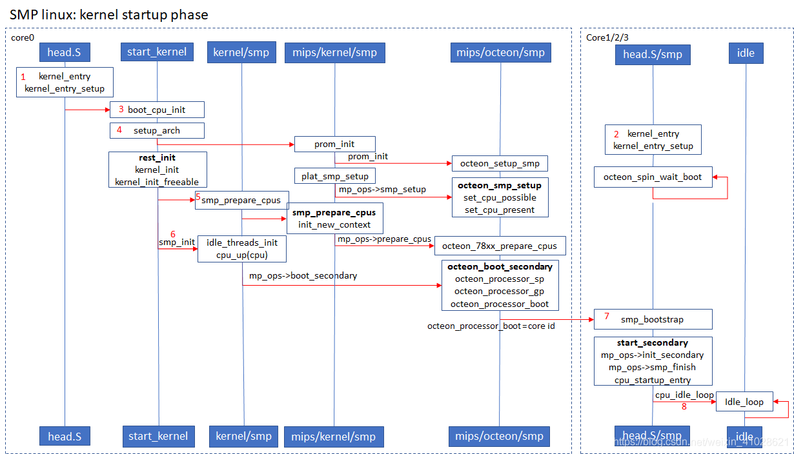
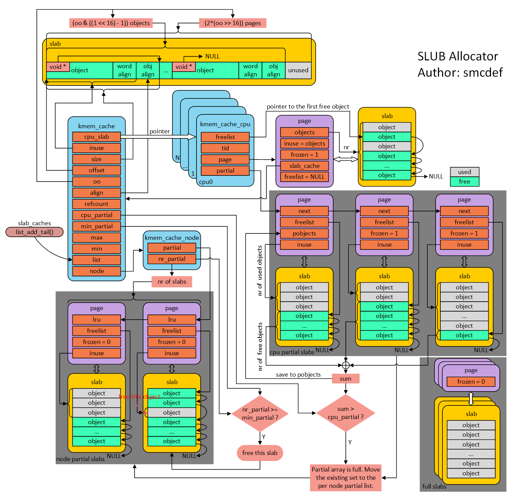
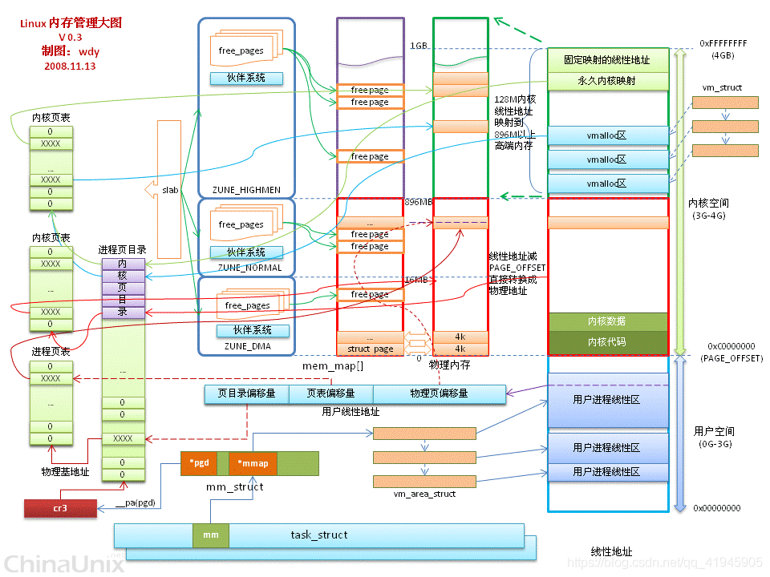

# 实现思路

- TLB配置

## 设计思路

- 采用离散的存储管理方式
- 采用四级分页结构，每页大小4KB
- 利用位示图描述物理块信息
- 设计页表数据结构
- 启动MMU，设置TLB
- 研究内存管理算法

## 工作流程

    a.系统初始化代码会在内存中生成页表，然后把页表地址设置给MMU对应寄存器，使MMU知道页表在物理内存中的什么位置，以便在需要时进行查找。之后通过专用指令启动MMU，以此为分界，之后程序中所有内存地址都变成虚地址，MMU硬件开始自动完成查表和虚实地址转换。
    b.OS初始化后期，创建第一个用户进程，这个过程中也需要创建页表，把其地址赋给进程结构体中某指针成员变量。即每个进程都要有独立的页表。
    c.用户创建新进程时，子进程拷贝一份父进程的页表，之后随着程序运行，页表内容逐渐更新变化。

# 参考资料

- 早期内存分配管理

[【linux 内存管理】memblock算法简单梳理_bigDxin的博客-CSDN博客](https://blog.csdn.net/zhangwenxinzck/article/details/105307799?spm=1001.2101.3001.6650.2&utm_medium=distribute.pc_relevant.none-task-blog-2%7Edefault%7ECTRLIST%7ERate-2-105307799-blog-124286916.pc_relevant_aa_2&depth_1-utm_source=distribute.pc_relevant.none-task-blog-2%7Edefault%7ECTRLIST%7ERate-2-105307799-blog-124286916.pc_relevant_aa_2&utm_relevant_index=5)

[(91条消息) 内核杂谈——页表项存放的是物理地址还是虚拟地址？_LuckY_chh的博客-CSDN博客_create_pgd_mapping](https://blog.csdn.net/m0_37797953/article/details/113650688?spm=1001.2101.3001.6650.3&utm_medium=distribute.pc_relevant.none-task-blog-2~default~BlogCommendFromBaidu~Rate-3-113650688-blog-101612855.t0_edu_mix&depth_1-utm_source=distribute.pc_relevant.none-task-blog-2~default~BlogCommendFromBaidu~Rate-3-113650688-blog-101612855.t0_edu_mix&utm_relevant_index=4)

[(91条消息) Linux内存管理之MMU的过程_布道师Peter的博客-CSDN博客_linux mmu](https://blog.csdn.net/melody157398/article/details/106846311)

[(91条消息) 【Linux】Linux的虚拟内存详解（MMU、页表结构）__kerneler的博客-CSDN博客](https://blog.csdn.net/qq_38350702/article/details/109508057?spm=1001.2101.3001.6650.5&utm_medium=distribute.pc_relevant.none-task-blog-2~default~BlogCommendFromBaidu~Rate-5-109508057-blog-127061728.pc_relevant_3mothn_strategy_and_data_recovery&depth_1-utm_source=distribute.pc_relevant.none-task-blog-2~default~BlogCommendFromBaidu~Rate-5-109508057-blog-127061728.pc_relevant_3mothn_strategy_and_data_recovery&utm_relevant_index=10)

[(91条消息) 硬件篇之MMU_ipmux的博客-CSDN博客_mmu](https://blog.csdn.net/ipmux/article/details/19167605)

[(91条消息) 深度学习arm MMU一篇就够了_代码改变世界ctw的博客-CSDN博客_smmu granule](https://blog.csdn.net/weixin_42135087/article/details/123573475?spm=1001.2101.3001.6661.1&utm_medium=distribute.pc_relevant_t0.none-task-blog-2~default~CTRLIST~Rate-1-123573475-blog-19167605.pc_relevant_multi_platform_whitelistv3&depth_1-utm_source=distribute.pc_relevant_t0.none-task-blog-2~default~CTRLIST~Rate-1-123573475-blog-19167605.pc_relevant_multi_platform_whitelistv3&utm_relevant_index=1)

- 龙芯地址路由

[(94条消息) 龙芯3B处理器—地址映射以及路由地址分布与配置_hansome913的博客-CSDN博客](https://blog.csdn.net/hansome913/article/details/51476492)

[(94条消息) 国产处理器龙芯地址空间详解_qq_26989627的博客-CSDN博客](https://blog.csdn.net/qq_26989627/article/details/109107667?spm=1001.2101.3001.6650.4&utm_medium=distribute.pc_relevant.none-task-blog-2%7Edefault%7ECTRLIST%7ERate-4-109107667-blog-51476492.pc_relevant_multi_platform_whitelistv4&depth_1-utm_source=distribute.pc_relevant.none-task-blog-2%7Edefault%7ECTRLIST%7ERate-4-109107667-blog-51476492.pc_relevant_multi_platform_whitelistv4&utm_relevant_index=5)

[(99条消息) 龙芯64bit地址空间_Life_Maze的博客-CSDN博客](https://blog.csdn.net/Life_Maze/article/details/97916874?spm=1001.2101.3001.6650.16&utm_medium=distribute.pc_relevant.none-task-blog-2%7Edefault%7EBlogCommendFromBaidu%7ERate-16-97916874-blog-109107667.pc_relevant_aa&depth_1-utm_source=distribute.pc_relevant.none-task-blog-2%7Edefault%7EBlogCommendFromBaidu%7ERate-16-97916874-blog-109107667.pc_relevant_aa&utm_relevant_index=17)

[(94条消息) 龙芯内核启动流程（一）_Hacker_Albert的博客-CSDN博客](https://blog.csdn.net/weixin_41028621/article/details/108809089)



> 系统加电启动后，任何MIPS Core都是从系统的虚拟地址0xbfc00000(BIOS入口地址)启动的，其对应的物理地址为0x1FC00000。因为上述地址处于kseg1中，所以此时系统不需要TLB映射就能够运行（这段空间通过去掉最高的三位来获得物理地址）。CPU从物理地址0x1FC00000开始取第一条指令，这个地址在硬件上已经确定为FLASH（BIOS）的位置，BIOS将Linux内核镜像文件拷贝到RAM中某个空闲地址（LOAD地址）处，然后一般有个内存移动的操作（Entry point(EP)的地址），最后BIOS跳转到EP指定的地址运行，此时开始运行Linux kernel。
> ————————————————
> 版权声明：本文为CSDN博主「Hacker_Albert」的原创文章，遵循CC 4.0 BY-SA版权协议，转载请附上原文出处链接及本声明。
> 原文链接：https://blog.csdn.net/weixin_41028621/article/details/108809089

- TLB介绍

[TLB原理 - 知乎 (zhihu.com)](https://zhuanlan.zhihu.com/p/108425561)

TLB是translation lookaside buffer的简称。首先，我们知道MMU的作用是把虚拟地址转换成物理地址。虚拟地址和物理地址的映射关系存储在页表中，而现在页表又是分级的。64位系统一般都是3~5级。常见的配置是4级页表，就以4级页表为例说明。分别是 `PGD、PUD、PMD、PTE`四级页表。在硬件上会有一个叫做页表基地址寄存器，它存储PGD页表的首地址。MMU就是根据页表基地址寄存器从PGD页表一路查到PTE，最终找到物理地址(PTE页表中存储物理地址)。


- 启动MMU

[从零开始的ARMv8操作系统内核实践 3 为内核启动MMU - 知乎 (zhihu.com)](https://zhuanlan.zhihu.com/p/435684493)

[(95条消息) 深入浅出MIPS 二 MIPS的内存映射 ._myxmu的博客-CSDN博客](https://blog.csdn.net/myxmu/article/details/10513207?spm=1001.2101.3001.6650.2&utm_medium=distribute.pc_relevant.none-task-blog-2~default~CTRLIST~Rate-2-10513207-blog-8630681.pc_relevant_3mothn_strategy_and_data_recovery&depth_1-utm_source=distribute.pc_relevant.none-task-blog-2~default~CTRLIST~Rate-2-10513207-blog-8630681.pc_relevant_3mothn_strategy_and_data_recovery&utm_relevant_index=3)

[(99条消息) 内存算法-伙伴(buddy)算法_才不是本人的博客-CSDN博客_伙伴算法的优缺点](https://blog.csdn.net/helloworld_ptt/article/details/115599230)

[(99条消息) 伙伴分配器(buddy allocator)和slab_birate_小小人生的博客-CSDN博客_伙伴分配器](https://blog.csdn.net/u014183456/article/details/122031750?spm=1001.2101.3001.6650.9&utm_medium=distribute.pc_relevant.none-task-blog-2%7Edefault%7EBlogCommendFromBaidu%7ERate-9-122031750-blog-127184863.pc_relevant_recovery_v2&depth_1-utm_source=distribute.pc_relevant.none-task-blog-2%7Edefault%7EBlogCommendFromBaidu%7ERate-9-122031750-blog-127184863.pc_relevant_recovery_v2&utm_relevant_index=10)

[(102条消息) slab分配器_phone1126的博客-CSDN博客](https://blog.csdn.net/phone1126/article/details/113877347)

[一文看懂slab分配器实现 - 知乎 (zhihu.com)](https://zhuanlan.zhihu.com/p/523241576)

[(102条消息) linux的slub算法原理,图解slub_十二.12的博客-CSDN博客](https://blog.csdn.net/weixin_35748716/article/details/116900414?app_version=5.10.0&code=app_1562916241&csdn_share_tail=%7B%22type%22%3A%22blog%22%2C%22rType%22%3A%22article%22%2C%22rId%22%3A%22116900414%22%2C%22source%22%3A%22weixin_50904351%22%7D&uLinkId=usr1mkqgl919blen&utm_source=app)



[(102条消息) 世上最强最全Linux 内存总结（用户空间：malloc、内核空间:vmalloc kmalloc slab buddy ）_小卷怡情的博客-CSDN博客](https://blog.csdn.net/qq_41945905/article/details/116461064?spm=1001.2101.3001.6650.5&utm_medium=distribute.pc_relevant.none-task-blog-2%7Edefault%7ECTRLIST%7ERate-5-116461064-blog-89521003.pc_relevant_3mothn_strategy_recovery&depth_1-utm_source=distribute.pc_relevant.none-task-blog-2%7Edefault%7ECTRLIST%7ERate-5-116461064-blog-89521003.pc_relevant_3mothn_strategy_recovery&utm_relevant_index=6)



[Linux 内核 | 内存管理——slab 分配器 - 知乎 (zhihu.com)](https://zhuanlan.zhihu.com/p/358891862)

[(102条消息) 函数实现_如何实现一个malloc函数_躺着不干活的博客-CSDN博客](https://blog.csdn.net/weixin_34980267/article/details/112673550)

# 信息记录

## MEM_MAP

```c
loongson_mem_map->count = 15

0 type:1;   start:0x00200000;    size:0x0ee00000;

1 type:2;   start:0x0f000000;    size:0x01000000;

2 type:1;   start:0x00000000;    size:0x10000000; //256MB

3 type:1;   start:0x90000000;    size:0xf0000000; //3840MB 3.75GB

4 type:1;   start:0x00000000;    size:0x10000000;

5 type:1;   start:0x90010000;    size:0x6e6c0000;

6 type:1;   start:0xfe6e0000;    size:0x00010000; //FE6F

7 type:1;   start:0xfe700000;    size:0x00190000; //FE89

8 type:1;   start:0xfef10000;    size:0x01080000;

9 type:1;   start:0xfffe0000;    size:0x80020000; //18000

10 type:1;   start:0x100d0000;    size:0x00001000; //FFF9

11 type:2;   start:0xfe6f0000;    size:0x00010000; //FE70

12 type:2;   start:0xfe890000;    size:0x002c0000; //FEB5

13 type:2;   start:0xfeb60000;    size:0x003b0000; //FEF1

14 type:2;   start:0xfff90000;    size:0x00050000; //FFFE
```
